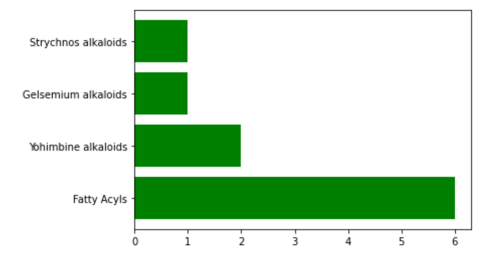
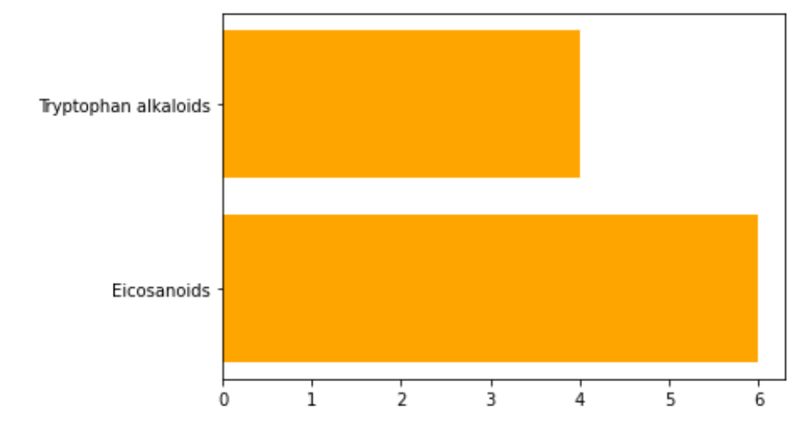

# Omigami

[](https://pypi.python.org/pypi/omigami) [](https://opensource.org/licenses/MIT)

<!-- image:: https://img.shields.io/travis/datarevenue-berlin/omigami.svg :target: https://travis-ci.org/datarevenue-berlin/omigami -->

<!-- image:: https://readthedocs.org/projects/omigami/badge/?version=latest :target: https://omigami.readthedocs.io/en/latest/?badge=latest :alt: Documentation Status -->


A package to access Omigami services.

## Installation
Omigami supports python 3.7 up to 3.9. To install it, simply:

```sh
pip install omigami
```
To be able to visualise the molecule plots, you need to install `rdkit`.
For Mac and Linux users, please do: 

```sh
pip install omigami[plots]
```
For Windows users, you need to do the following:

```sh
conda install -c conda-forge rdkit
```

## Acknowledgement

### Spec2Vec 
Huber F, Ridder L, Verhoeven S, Spaaks JH, Diblen F, Rogers S, et al. (2021) Spec2Vec: Improved mass spectral similarity scoring through learning of structural relationships. PLoS Comput Biol 17(2): e1008724. https://doi.org/10.1371/journal.pcbi.1008724

### MS2DeepScore
Florian Huber, Sven van der Burg, Justin J.J. van der Hooft, Lars Ridder. (2021) MS2DeepScore - a novel deep learning similarity measure for mass fragmentation spectrum comparisons. bioRxiv 2021, doi: https://doi.org/10.1101/2021.04.18.440324 

## Motivation
Motivation
We aim to support metabolomics research by providing the following :
- Easy-to-use tools
- Access and scalability to the newest algorithms
- Maintenance, support and documentation of software, models and data
- A community of metabolomics researchers via our [Slack](https://join.slack.com/t/ml4metabolomics/shared_invite/zt-r39udtdg-G36YE6GQt1YdVIwTdeT8aw)

## Features

- [x] Spec2Vec spectra matching
- [x] MS2Deep score

## Usage

### Configuration
Before start using Omigami, you will need to signup at omigami.com and verify your email to confirm your account.
Then, you should configure your credentials in your working machine.
You can do so by using the command line utility `omigami credentials-helper` 
and providing the parameters `--username <yourusername> --password <yourpassword>`

Your encrypted credentials will be safely stored in your machine, if you want to revoke the configuration at any point,
you may use `omigami credentials-helper --unset`.

### Spec2Vec
#### Quickstart

```python
from omigami import Spec2Vec

client = Spec2Vec()

mgf_file_path = "path_to_file.mgf"
n_best_matches = 10
include_metadata = ["Smiles", "Compound_name"]
ion_mode = "positive"  # either positive or negative

result = client.match_spectra_from_path(
    mgf_file_path, n_best_matches, include_metadata, ion_mode=ion_mode,
)
```

The supported metadata keys for omigami are (case insensitive):
- "smiles",
- "compound_name",
- "instrument",
- "parent_mass",
- "inchikey_smiles",
- "inchikey_inchi"

#### Notebooks
You can find a [tutorial](https://github.com/omigami/omigami/blob/master/notebooks/spec2vec/tutorial.ipynb) notebook in the `/notebooks/` folder.

### MS2DeepScore
#### Quickstart

```python
from omigami import MS2DeepScore

client = MS2DeepScore()

mgf_file_path = "path_to_file.mgf"
n_best_matches = 10
include_metadata = ["Smiles", "Compound_name"]
ion_mode = "positive"  # either positive or negative

result = client.match_spectra_from_path(
    mgf_file_path, n_best_matches, include_metadata, ion_mode=ion_mode,
)
```

#### Notebooks
You can find a [tutorial](https://github.com/omigami/omigami/blob/master/notebooks/ms2deepscore/tutorial.ipynb) notebook in the `/notebooks/` folder.

#### Plotting
Plotting graphs works the same way for both Spec2Vec and MS2DeepScore.


The following example will plot the structures of the molecules
```python
from omigami import MoleculePlotter
plotter = MoleculePlotter()
plotter.plot_molecule_structure_grid(best_matches, 
                                     draw_indices=True, 
                                     molecule_image_size=[600, 600], 
                                     substructure_highlight="C(=O)")
```

The following code allows us to plot the results of the [Classyfire](https://jcheminf.biomedcentral.com/articles/10.1186/s13321-016-0174-y) model API.
```python
from omigami import MoleculePlotter
plotter = MoleculePlotter()
plotter.plot_classyfire_result(best_matches)
```


Furthermore, Omigami provides the possibility to use the [NPClassifier](https://www.researchgate.net/publication/344008670_NPClassifier_A_Deep_Neural_Network-Based_Structural_Classification_Tool_for_Natural_Products) API.

```python
from omigami import MoleculePlotter
plotter = MoleculePlotter()
plotter.plot_NPclassifier_result(best_matches, color='orange')
```


## How it works

### Spec2Vec
1. Save your spectra data in a MGF file locally
2. Create an Spec2Vec with your user token
3. Call `match_spectra_from_path` with the location of your mgf file.
4. The MGF spectra data will be processed and sent to the spec2vec model that will convert it into embeddings. 
5. These embeddings will be compared against the reference embeddings around the Precursor MZ.
6. The N best matches per spectrum are returned on the response as pandas dataframes.  

### MS2DeepScore
1. Save your pair of spectra data in a MGF file locally
2. Create an MS2DeepScore object with your user token
3. Call `match_spectra_from_path` with the location of your mgf file.
4. The MGF spectra data will be processed and sent to the trained neural network that will predict the molecular structural similarity. 
5. The prediction is returned on the response as a pandas dataframe.  

## Contribute to Omigami

1. Fork it (https://github.com/omigami/omigami/fork)
2. Create your feature branch (git checkout -b feature/fooBar)
3. Commit your changes (git commit -am 'Add some fooBar')
4. Push to the branch (git push origin feature/fooBar)
5. Create a new Pull Request

## License
MIT license - free software.